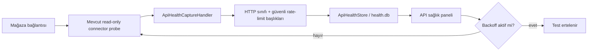

# API bağlantı sağlığı (M34 / Issue #51)

API sağlık merkezi, kanal ve mağaza bazında bağlantı testlerinin teknik sonucunu tek yerde görünür yapar. Mevcut bağlantı ekranındaki testler salt okunurdur; ürün, fiyat, stok veya sipariş yazımı çağrılmaz.

## Saklanan durumlar

`HEALTHY`, `NOT_CONFIGURED`, `LIVE_API_BLOCKED`, `AUTH_ERROR`, `RATE_LIMITED`, `SERVER_ERROR`, `NETWORK_ERROR`, `TIMEOUT`, `CLIENT_ERROR` ve `UNKNOWN` durumları; `Authentication`, `RateLimit`, `Server`, `Network`, `Timeout`, `Client`, `Unsupported`, `NotConfigured` ve `Unknown` hata sınıflarıyla ayrılır. Son başarılı istek başarısız bir testten sonra korunur.

401/403 auth hatası, 429 rate-limit, 408 timeout, 5xx sunucu ve ağ/timeout istisnaları ayrı gösterilir. Response gövdesi kaydedilmez. Yalnız resmi yanıt başlıklarından doğrulanabilen `X-RateLimit-*`, `RateLimit-*` ve `Retry-After` değerleri saklanır; bilinmeyen quota alanları uydurulmaz.

## Backoff ve kuyruk uyumu

`Retry-After` varsa doğrudan bekleme sonu hesaplanır. 429 için başlık yoksa 60 saniye, 5xx/timeout için 30 saniye, ağ hatası için 15 saniye yerel backoff uygulanır. `ApiHealthStore.ShouldDefer` Sync/Automation üst katmanlarının yeni HTTP denemeden önce kullanabileceği kapıdır. Bağlantı ekranındaki manuel test de backoff süresince ertelenir; retry isteği gereksiz yere çoğaltılmaz.

## Ekran ve güvenlik

**API bağlantı sağlığı** ekranı kanal, mağaza, durum, auth, HTTP kodu, hata sınıfı, rate-limit, son başarılı istek, backoff ve son hatayı gösterir. Arama/durum filtresi, yenileme, mevcut salt okunur test ekranına geçiş ve kanal ekranına geçiş vardır. Credential, token, API key ve response body hiçbir UI veya SQLite alanına yazılmaz; hata metni `AuditStore.Sanitize` ve mevcut redaction katmanından geçer.

Doğrulanmamış kanallar `LIVE_API_BLOCKED` olarak görünür ve endpoint çağrısı yapılmaz.
