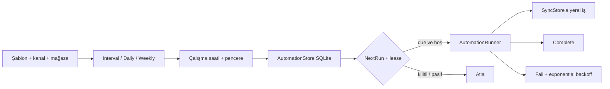

# Otomasyon takvimi ve şablonları (M35 / Issue #52)

Otomasyon ekranı mevcut yerel lease/SQLite kuyruğunu korur ve stok/fiyat akışlarına XML, normal sync ve sağlık kontrolü şablonlarını ekler. Zamanlama yalnız uygulama açıkken çalışır; Windows arka plan servisi veya kullanıcıdan gizli ağ çağrısı varsayılmaz.

## Şablonlar

`xml-refresh`, `stock-sync`, `price-sync`, `health-check` ve `normal-sync` tekrar kullanılabilir başlangıç profilleridir. Her kayıt kanal ve mağaza ile ayrılır; seçilen tür için mevcut preview/sync kapısı korunur. XML ve sağlık işleri endpoint uydurmaz, yalnız yerel sync işi oluşturur.

## Takvim ve çalışma penceresi

`Interval` dakika aralığını kullanır. `Daily` ve `Weekly` yerel `HH:mm` saatiyle hesaplanır; haftalık günler `Monday,Wednesday` biçiminde saklanır. İsteğe bağlı başlangıç/bitiş penceresi dışındaki çalışma bir sonraki uygun güne taşınır. Sonraki çalışma UTC saklanır, arayüz yerel saate çevirir.

## Lease, retry ve audit

`TryClaim` atomik `LockedUntilUtc` lease'iyle aynı işin paralel çalışmasını engeller. Başarılı iş lease'i temizler ve takvime göre yeni `NextRunUtc` hesaplar. Hatalı işte retry limiti, 1/2/4… dakika üstel backoff ve maksimum 24 saat sınırı vardır; limit bitince normal takvime dönülür. Hata metni mevcut redaction'dan geçer. Kaydetme, etkinlik değişimi ve manuel çalıştırma `AuditStore` kaydına alınır.

## Durum görünürlüğü

Otomasyon tablosu şablon/tür, kanal, mağaza, etkinlik, sonraki çalışma, lease, retry sayısı ve son hatayı gösterir. “Seçileni şimdi çalıştır” yalnız `NextRunUtc` değerini due yapar; duplicate çalışmayı lease engeller. Uygulama kapalı davranışı ekranda açıkça belirtilir.
