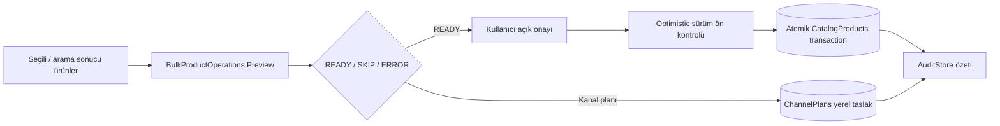

# Güvenli toplu ürün işlemleri

Toplu işlem merkezi ürün seçimi veya arama sonucunu önce satır bazlı preview'e dönüştürür. Ürün sürümü değişirse tüm katalog transaction'ı iptal edilir; kısmi yazma yapılmaz.

## Desteklenen normal işlemler

- Aktif yap / pasif yap.
- Kategori, marka, ad ve açıklama değerini toplu ayarla.
- Kanal + mağaza için listing ID/hedef kategori yerel planı oluştur.

Hızlı satır içi düzenleme, kritik fiyat, bundle/set ve diğer `DEFERRED_BY_USER` alanları bu merkeze eklenmez. Ürün kilitleri ve boş zorunlu değerler preview'de SKIP/ERROR olur.

## Güvenlik sınırı

Preview satırında SKU, eski/yeni değer, beklenen `UpdatedUtc` ve hata görünür. Uygulama öncesi tüm ürün sürümleri yeniden okunur; bir ürün stale ise hiçbir ürün yazılmaz. Kanal planı yalnız yerel `ChannelProductsStore`'a kaydedilir; canlı connector HTTP çağrısı toplu olarak tetiklenmez. Uzun işlem `CancellationToken` ve ilerleme çubuğu ile iptal edilebilir.
