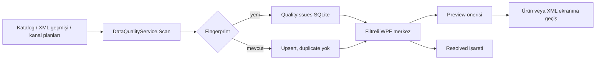

# Veri kalite merkezi (M33 / Issue #50)

Veri kalite merkezi, canlı senkronizasyon öncesi ürün, XML ve yerel kanal planı kayıtlarını tarar. Tarama yalnız sorun kaydı üretir; ürün, stok, fiyat veya pazaryeri kaydını otomatik değiştirmez.

## Kontroller

- Duplicate SKU ve barkod: kritik; kataloglar arası aynı kimliği görünür yapar.
- Duplicate kanal/mağaza/listing ID: kritik; canlı eşleştirme öncesi durdurma adayıdır.
- Eksik ad veya SKU/barkod, negatif fiyat/maliyet/stok, desteklenmeyen döviz ve bozuk görsel URL'si.
- Silinmiş XML kaynağına bağlı ürünler ve başarısız XML çalışmaları.
- Capability'si canlı yazıma kapalı kanallardaki yerel planlar `LiveApiBlocked` uyarısıdır; sahte endpoint çağrılmaz.

## Veri ve idempotency

`quality.db` içinde `Fingerprint` benzersizdir. Fingerprint; sorun türü, ürün/kaynak/kanal kimlikleri ve mesajdan SHA-256 ile üretilir. Aynı tarama tekrarlandığında yeni satır oluşmaz. Kullanıcının `Resolved` durumu yeniden taramada korunur; yeni mesaj veya kaynak kimliği değişirse yeni sorun adayı oluşur.

Mesaj ve öneri alanları `MarketplaceConnectionStore.Redact` ile maskelenir. Credential, token veya API anahtarı kalite veritabanına yazılmaz.

## Ekran

Sol menüde **Veri kalite merkezi** bulunur. Arama; SKU, ürün, kaynak, kanal ve mağaza alanlarında çalışır. Önem, durum ve sorun türü filtreleri; tarama/yenileme ve seçili kaydı `Resolved` işaretleme butonları vardır. Ürün ve XML merkezine geçiş yalnız bağlam navigasyonudur; otomatik düzeltme yapmaz.

## Sınırlar

Düzeltme önerileri preview niteliğindedir. Marketplace write, toplu otomatik düzeltme, varyant/bundle ve kullanıcı tarafından ertelenen çekirdekler bu modülün kapsamı değildir.
