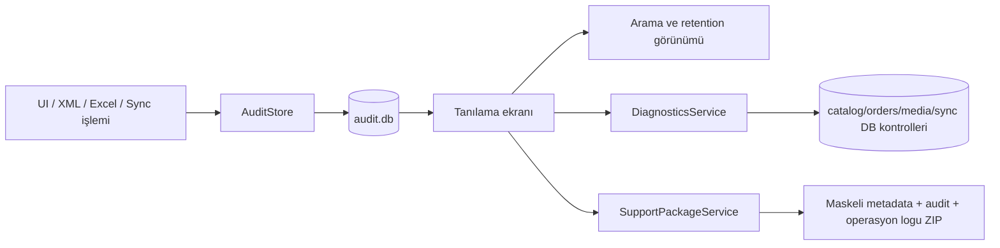

# Tanılama, audit trail ve destek merkezi

M28, masaüstü uygulamasının yerel durumunu incelenebilir hale getirir ve destek için güvenli bir paket üretir. Modül canlı pazaryeri verisi değiştirmez; credential değerlerini çözmez.

## Akış

## Audit sınırı

`AuditEvent` zaman, modül, eylem, ürün/sipariş kimliği, kanal/mağaza, sonuç ve ayrıntı alanlarını taşır. `password`, `token`, `secret`, `api_key`, `client_secret` gibi desenler kayda girmeden `[redacted]` ile maskelenir. Son 5000 kayıt tutulur; silme ve credential çözme yapılmaz.

## Tanılama kontrolleri

`DiagnosticsService` katalog, sipariş, medya, audit ve Excel profil veritabanlarının varlığını/özet boyutunu; SyncStore okumasını; pending/failed sayaçlarını; katalog DB okunabilirliğini ve son maskeli hatayı raporlar. Kontroller salt-okunurdur.

## Destek paketi

Destek paketi aşağıdaki dosyaları içerir:

- `diagnostics.json`: sürüm, kontroller, pending/failed sayaçları.
- `connections-metadata.json`: kanal/mağaza durum metadatası; hata metni maskeli.
- `xml-sources-metadata.json`: XML kaynak adı/durumu; konum maskeli.
- `audit.json`: retention sınırına kadar maskeli audit kayıtları.
- `operations.log`: son 1000 satır maskelenmiş operasyon kaydı.
- `README.txt`: paketin güvenlik kapsamı.

Yerel SQLite dosyaları ve DPAPI ile şifrelenmiş credential byte'ları ZIP'e alınmaz. Paket üretimi `Tanılama / audit` ekranındaki kullanıcı eylemiyle yapılır.

## Test ve sınırlar

Audit redaction, retention, destek paketinin credential içermemesi ve başarısız sync tanılaması Release testlerinde doğrulanır. Canlı connector mutation, otomatik retry/recovery ve credential görüntüleme bu modülün kapsamı değildir.
