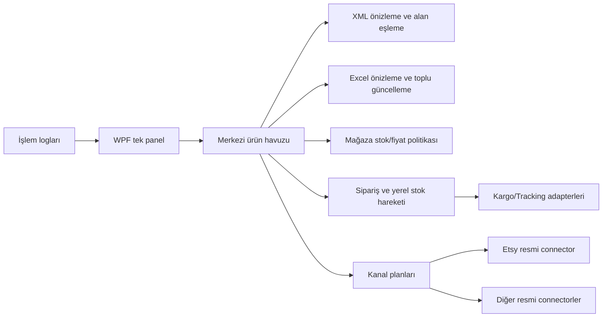

# Özgün masaüstü mimarisi

## İlkeler

- Merkezi ürün tek kez tutulur; kanal kayıtları `ChannelId + ShopId + ProductId` kimliğiyle ayrılır.
- Dış API credentialları şifreli saklanır ve loglara yazılmaz.
- API bulunmayan kanal için endpoint uydurulmaz; durum `NOT_CONFIGURED`/desteklenmiyor kalır.
- Canlı yazma işlemi önizleme ve açık işlem bağlamı olmadan çağrılmaz.
- SQLite işlemleri atomik ve idempotent olur; stok düşümü receipt/movement ile kanıtlanır.
- Ertelenen yedi alan yeni kod, ekran veya test kapsamına alınmaz.

## Entegra-3 ile fark

Marketplace başına ayrı kopya tablo çoğaltmak yerine ortak çekirdek ve connector capability modeli kullanılır. Bu, mevcut masaüstü uygulamanın küçük ve denetlenebilir kalmasını sağlar; statik decompile çıktısındaki özel isimler ve tasarım varlıkları kullanılmaz.
