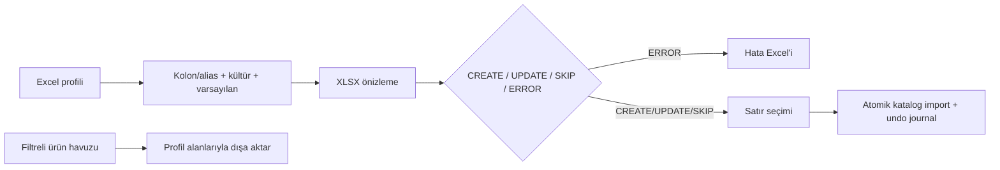

# Excel şablon ve aktarım merkezi

Profil dosyaya bağlı değildir; yerel `excel-profiles.db` içinde tutulur. SKU birincil, barkod ikincil eşleştirme anahtarıdır. Profil önizlemesi tamamlanmadan toplu yazma başlamaz. Secret veya credential alanları profil şemasına alınmaz; varyant/bundle alanları kullanıcı kararıyla kapsam dışıdır.
