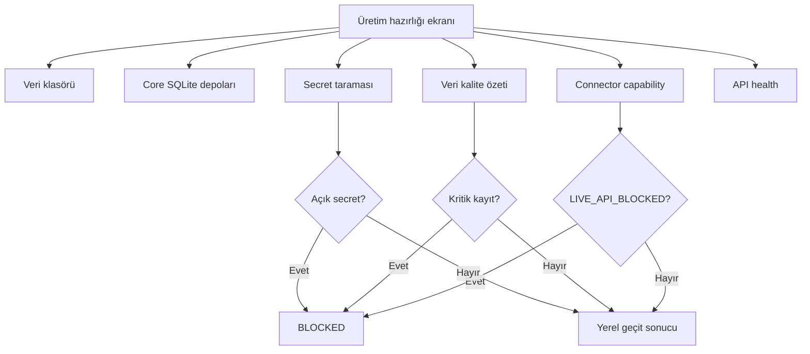

# M40 — Son üretim sertleştirmesi

`Üretim hazırlığı` ekranı, masaüstü uygulamanın gerçek veriye dokunmadan yayın öncesi durumunu tek yerde gösterir.

## Kontroller

- **data-directory:** LocalAppData veri klasörünün oluşturulabilir, okunabilir ve yazılabilir olduğunu doğrular.
- **core-stores:** Katalog, sipariş, sync ve audit SQLite depolarının açılıp okunabildiğini doğrular.
- **secret-scan:** Metin log/export/config dosyalarında açık token, parola, API key veya secret atamasını arar. DB dosyaları ve DPAPI byte'ları metin taramasına sokulmaz; değerler rapora yazılmaz.
- **data-quality:** Açık kritik/hata/uyarı kayıtlarını gösterir. Kritik kayıt varsa geçit `BLOCKED` olur.
- **connector-capabilities:** `MarketplaceConnectionCatalog` içindeki resmi sözleşme durumunu gösterir. Doğrulanmamış kanallar `LIVE_API_BLOCKED` kalır; bu kontrol geçidi bilerek bloklar.
- **api-health:** Son bağlantı sağlık kayıtlarını ve hata/backoff durumunu özetler.

## Güvenlik sınırı

Bu modül hiçbir marketplace endpoint'ine çağrı yapmaz, credential store'dan gizli değer çözmez ve canlı ürün/stok/fiyat/sipariş değişikliği başlatmaz. `PASS`, yerel kontrolün geçtiği anlamına gelir; dış API'nin üretime hazır olduğu anlamına gelmez.

## Günlük doğrulama akışı

Canlı connector dispatch'i ayrı preview/onay kapılarından geçer. Bu rapor bu kapıları bypass etmez.
