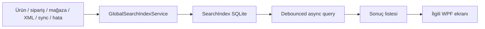

# Global arama ve yerel indeks (M37 / Issue #54)

Global arama; ürün, sipariş, mağaza, kanal ilanı, XML kaynağı/çalışması, sync işi, veri kalite kaydı ve API sağlığı kayıtlarını tek yerel SQLite indeksinde arar. İndeks `search-index.db` içinde tutulur ve kaynak verilerden yeniden üretilebilir.

## Güvenlik ve sınırlar

- Credential, token, parola, API anahtarı, XML URL'sindeki kullanıcı bilgileri, müşteri alanları ve mesaj gövdeleri indekse alınmaz.
- Hata metinleri mevcut `AuditStore.Sanitize` katmanından geçirilir.
- Ürün değişikliği `RefreshProducts` ile indeksi geçersiz kılar; arama gerektiğinde en fazla 30 saniyelik yerel cache yenilenir.
- Arama sorgusu 2–200 karakterle sınırlıdır; LIKE joker karakterleri escape edilir ve sonuç sayısı 200 ile sınırlıdır.
- İndeks değişimi transaction içinde topluca yapılır; iptal edilen rebuild eski indeksin üzerine yazılmaz.

## Ekran davranışı

`Ctrl+K` veya üstteki arama kutusu ile başlatılan arama UI thread'i bloklamadan çalışır. Yeni arama, önceki `CancellationToken` çalışmasını iptal eder. Sonuç seçildiğinde ürün, sipariş, XML, sync, veri kalite, API sağlığı veya mağaza bağlantısı ekranına geçilir. Canlı marketplace isteği oluşturulmaz.
