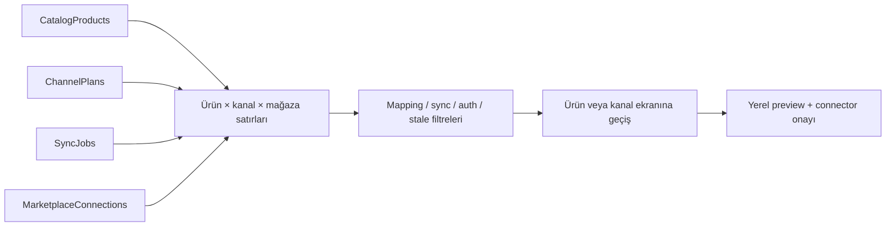

# Kanal yayın durumu ve ürün listeleme matrisi

Matris, `ChannelPlans` anahtarındaki kanal + mağaza + ürün bileşimini korur; bir mağazanın listing ID'si başka mağazada görünmez. Capability yalnız ilgili connector kayıtlarından okunur. Bu ekran canlı marketplace değişikliği başlatmaz.
