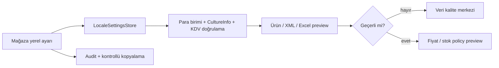

# Döviz, vergi ve yerel ayarlar (M36 / Issue #53)

Yerel ayar merkezi, kanal + mağaza bağlamında hedef para birimini, sayı/tarih kültürünü ve KDV metadata'sını tek SQLite deposunda tutar. Mevcut fiyat formülü/policy ve XML/Excel preview akışları korunur; muhasebe, hakediş veya mutabakat hesaplanmaz.

## Doğrulama

Desteklenen para birimleri mevcut çekirdekle aynı tutulur: TRY, USD, EUR, GBP. Kültürler `tr-TR`, `en-US`, `de-DE`, `en-GB` ile sınırlıdır. KDV oranı 0–100 aralığındadır; ürün kartında `VatRate` ve Excel'de `KDV %` kolonu vardır. Geçersiz ürün KDV'si `InvalidVatRate`, geçersiz döviz `InvalidCurrency` olarak veri kalite taramasına düşer.

`LocaleSettings.Format.ParseDecimal` ve `Decimal` aynı `CultureInfo` ile çalışır. Türkçe örnekte `1.234,56` güvenle 1234.56 olarak okunur; Excel profili kendi kültürünü kullanmaya devam eder ve ürün KDV kolonu aynı kültürle parse edilir. Bilinmeyen kültür veya sayı bozulması kabul edilmez.

## Mağaza kopyalama ve sınırlar

Bir mağazanın yerel ayarı başka kanal/mağazaya kopyalanabilir. Hedef yeni sürüm olarak kaydedilir ve audit event oluşur. Credential içermez. Fiyat policy'sinin formül, manuel kur, minimum fiyat ve minimum fark güvenlikleri aynen geçerlidir; kritik fiyat ve hakediş/mutabakat kapsam dışıdır.
