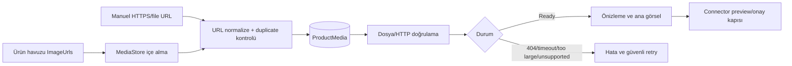

# Ürün görsel ve medya merkezi

Görsel kayıtları katalog JSON'undan bağımsız olarak `media.db` içinde tutulur. Böylece XML/Excel kaynağı, manuel giriş ve ileride doğrulanmış connector işlemleri aynı görünürlükte izlenebilir; mevcut `CatalogProduct.ImageUrls` alanı geriye dönük uyumluluk için korunur.

Doğrulama dosyayı okumakla sınırlıdır; hiçbir marketplace görseli değiştirilmez. URL'ler ürün içinde normalize edilir ve aynı URL ikinci kez kaydedilemez. Ana görsel kaldırılırsa en düşük sıra numarasındaki kayıt otomatik seçilir.
