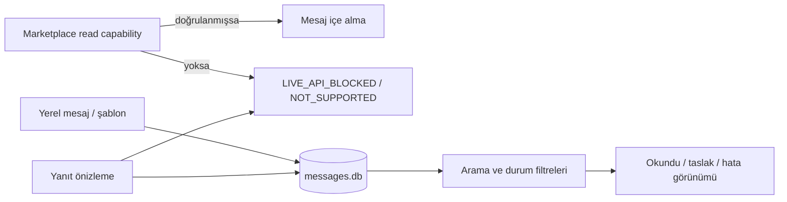

# Mesaj ve müşteri iletişim merkezi

Mesaj merkezi, müşteri/sipariş bağlamını yerel olarak tek listede toplar. Marketplace mesaj API'si doğrulanmadığı için hiçbir kanal adına sahte başarı veya sahte endpoint üretilmez.

## Veri ve güvenlik

`MessageStore`, kanal+mağaza, harici mesaj ID, sipariş/ürün bağlamı, müşteri, konu, gövde, yön, durum ve zaman alanlarını yerel SQLite'ta saklar. Harici ID mevcutsa `(Marketplace, ShopId, ExternalId)` duplicate kayıtları engeller; yerel yardımcı kayıtlar boş harici ID ile çoğalabilir. Hata alanı `AuditStore.Sanitize` ile token/password/secret/API key değerlerini maskeler. Mesaj gövdesi audit loguna yazılmaz.

## Ekran

- Kanal, mağaza, müşteri, sipariş, konu ve durum filtreleri.
- Okunmamış/okundu/taslak/hata sayaçları.
- Mesaj ayrıntısı ve ürün/sipariş ekranına bağlam geçişi.
- Yerel mesaj kaydı ve yerel yanıt şablonu.
- Yanıt önizlemesi; gerçek gönderim capability yoksa açıkça engellenir.

Etsy, eBay, Amazon, Trendyol, Hepsiburada, Ozon, Allegro, Joom, Wish ve Fruugo için güncel doğrulanmış mesaj capability'si bu modülde varsayılmaz. Resmi sözleşme ve credential scope doğrulanana kadar read/write işlemi ağ isteği oluşturmaz.
