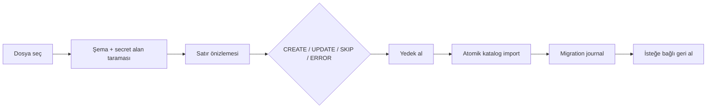

# Eski veri geçiş asistanı (M38 / Issue #55)

Geçiş asistanı, kullanıcının sahip olduğu Excel/CSV/TSV/JSON/XML dışa aktarımlarını özgün bir yerel modele taşır. Proprietary veritabanı veya decompile edilmiş dosya doğrudan okunmaz.

## Desteklenen davranış

- Excel, CSV/TSV, JSON ürün dizisi ve normal XML ürün düğümleri okunur.
- SKU öncelikli, barkod fallback eşleştirmesi yapılır; aynı dosyada duplicate kimlikler hata verir.
- Ürün, marka ve kategori alanları preview'de görünür. Uygulamada normal marka/kategori sözlüğü eksikleri oluşturulur.
- JSON içindeki yalnızca kanal, mağaza, görünen ad ve etkinlik alanları mağaza metadata planına alınır; credential alanları alınmaz.
- Uygulama öncesi kullanıcı yedeği seçer. Katalog değişimi transaction ile uygulanır ve `migration.db` içindeki journal geri alma receipt'iyle saklanır.
- Preview sonrası mevcut ürünün `UpdatedUtc` değeri değişmişse stale güvenliği nedeniyle uygulama durur.
- `password`, `token`, `secret`, `api_key`, `client_secret`, `access_key`, `refresh` gibi alanlar okunmaz; atlanan alan adları önizlemede raporlanır.

Canlı marketplace write, credential aktarımı ve deferred varyant/bundle alanları kapsam dışıdır.
