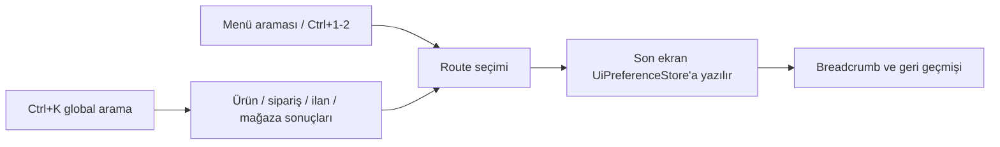

# M29 gezinme, kayıtlı görünümler ve UX

M29, günlük operasyonlarda tekrar tekrar filtre kurmayı ve menüler arasında kaybolmayı azaltan yerel masaüstü tercihlerini ekler. Tasarım özgündür; canlı pazaryeri yazma davranışlarını değiştirmez.

## Navigasyon akışı

Sol menüdeki arama yalnız görünen yerel ekranları filtreler. `‹ Geri` son iki bağlamı breadcrumb üzerinde korur. Son açılan route `ui-preferences.db` içinde saklanır ve program yeniden açıldığında güvenli bir route listesinde geri yüklenir.

## Görünüm profilleri

`UiPreferenceStore`, credential içermeyen `UiViews` tablosunda modül + ad + JSON payload saklar:

- **Ürünler:** mevcut katalog filtre profilleri ve kolon görünürlüğü.
- **Siparişler:** metin, durum, pazaryeri, mağaza ve stok filtresi.
- **Sync:** kanal, işlem, varlık, sürüm, arama ve durum filtresi.
- **XML:** seçili kaynak görünümü.

Aynı görünen ad farklı modüllerde birbirine karışmaz. Kullanıcı görünümü kaydedebilir, yükleyebilir ve silebilir. Hassas credential alanları bu store'a yazılmaz.

## Global komut/arama kutusu

Üst arama kutusu (Ctrl+K) SKU, barkod, ürün adı, sipariş numarası, listing ID, kanal/mağaza kimliği ve görünen mağaza adında yerel arama yapar. Sonuç seçildiğinde ilgili ekrana gider; marketplace API çağrısı yapılmaz.

## Klavye ve güvenli UX

- `Ctrl+K`: global aramaya odaklanır.
- `Ctrl+1`: Genel bakış.
- `Ctrl+2`: Ürün yönetimi.
- `F5`: yerel ürün listesini yeniler.
- Uzun sipariş/XML işlemlerindeki mevcut iptal kapıları korunur.
- Canlı değişiklikler hâlâ preview + açık onay gerektirir.

UI tercihleri yerel ve geri alınabilirdir; DB silinmesi halinde varsayılan menü ve kolonlar geri gelir.
