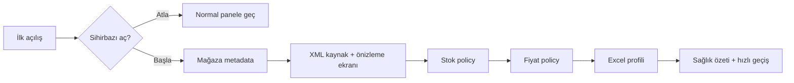

# İlk kurulum ve bağlantı sihirbazı (M39 / Issue #56)

İlk açılışta opsiyonel olarak görünen WPF sihirbazı temel mağaza metadata'sını, XML kaynağını, varsayılan stok/fiyat politikasını ve Excel profilini adım adım hazırlar. Kullanıcı sihirbazı atlayabilir; tamamlanan adımlar `onboarding.db` içinde yalnız metadata olarak saklanır ve yeniden açıldığında son adıma dönülür.

Credential, token, parola veya API secret alanı sihirbazın state'ine yazılmaz. Kanalı doğrulanmamış bağlantılar `NOT_CONFIGURED` veya `LIVE_API_BLOCKED` olarak gösterilir; salt yerel kurulum adımları marketplace'e write isteği göndermez. XML adresine kullanıcı bilgisi/query secret'ı gömülmesi reddedilir. Her policy kaydı mevcut optimistic version ve formül doğrulamasını kullanır.
