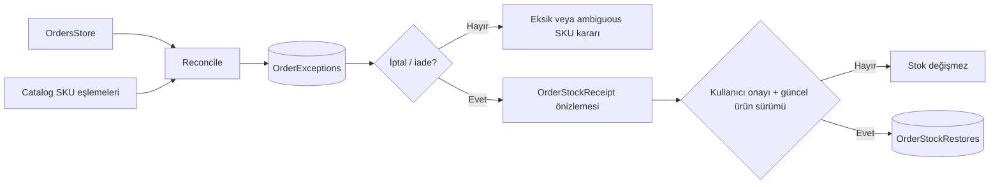

# Sipariş istisna ve iptal/iade karar merkezi

İstisna kaydı `(marketplace, shop, order, type, eventKey)` ile tekilleştirilir. Stok geri koyma ayrıca sipariş başına tek restore kaydı tutar; aynı olay veya yeniden açılan karar ikinci kez stok ekleyemez. Eski ürün sürümü ile yeni sürüm arasında fark varsa işlem reddedilir ve yeni önizleme istenir.
