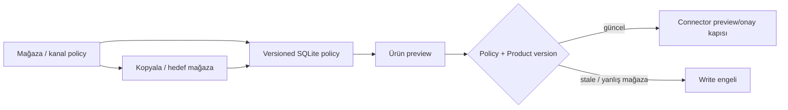

# Stok ve fiyat politika merkezi

Politika merkezi, mevcut yerel stok/fiyat çekirdeklerini kanal + mağaza bağlamında tek WPF ekranda toplar. Formül ve kur değerleri ürün fiyatını veya marketplace'i preview dışında değiştirmez.

## Stok

Güvenlik stoğu, maksimum gösterilebilir stok ve etkinlik saklanır. `available = active ? max(0, onHand - safetyStock) : 0` hesabı üst sınırla sınırlandırılır. `PreviewStockDetailed` policy sürümünü ve ürün `UpdatedUtc` değerini taşıdığı için üst katman stale kontrolü yapabilir.

## Fiyat

Mevcut izinli `PriceFormula` çekirdeği kullanılır: formül TL sonucu, hedef döviz kuru, minimum satış fiyatı ve minimum alış üstü farkı kontrol edilir. Kritik fiyat/marj motoru eklenmez. `PreviewPriceDetailed` policy ve ürün sürümlerini döndürür; canlı write yalnız ilgili connector'ın mevcut preview + açık onay akışından geçer.

## Kopyalama ve sınırlar

Bir policy kaynak kanal/mağazadan hedefe kontrollü olarak çoğaltılır; hedef sürümü korunur ve optimistic version ile kaydedilir. Yanlış mağaza, pasif policy veya stale ürün/policy canlı değişikliği tetiklemez. Policy listeleri credential içermez.
