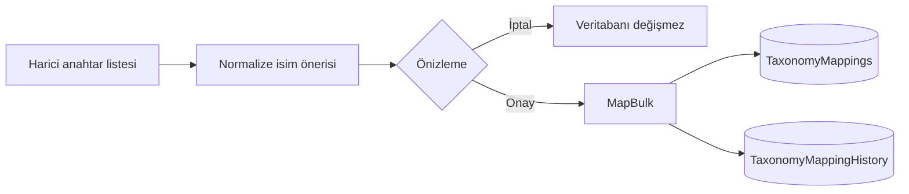

# Kategori, marka ve özellik eşleme merkezi

M23, yerel kategori/marka/özellik sözlüklerini marketplace ve mağaza bağlamından ayırır. Aynı harici anahtar farklı mağazalarda farklı yerel kayda eşlenebilir; `TaxonomyMappings` anahtarı `(Kind, Marketplace, ShopId, ExternalKey)` bileşimidir.

## Durumlar

- `MAPPED`: aktif yerel kayıt ve 180 günden yeni eşleme.
- `MISSING`: seçili kanal/mağazada eşleme yok.
- `STALE`: eşleme 180 günden eski ve metadata yenilemesi gözden geçirilmeli.
- `INVALID`: harici eşleme pasif yerel kayda bağlı.

## Güvenli eşleme akışı

İsim benzerliği yalnız öneri üretir. Uygulama, marketplace API'sine yazmaz; gerçek metadata yenilemesi yalnız doğrulanmış resmi connector capability'si eklendiğinde bağlanabilir. XML Variant Mapping kullanıcı tarafından ertelenmiştir.
